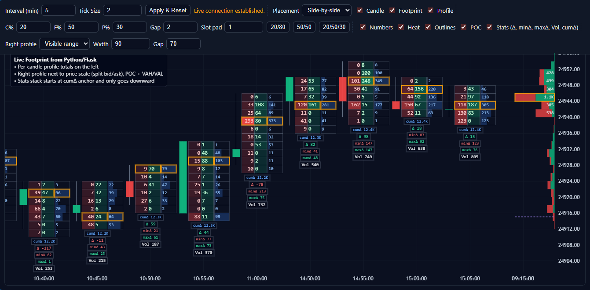

# Real-Time Footprint Chart for Stock Market Analysis

This project is a web-based, real-time footprint chart visualization tool for stock market data. It is built with a Python Flask backend that connects to a broker's WebSocket for live tick data, processes it into candles and footprint bars, and streams the updates to a modern, interactive frontend built with Lightweight Charts.



## Features

- **Real-Time Data Streaming**: Connects to a broker via WebSocket to receive and process live tick-by-tick trade data.
- **Footprint & Profile Visualization**: Generates and displays detailed footprint bars and volume profiles for each candle.
- **Interactive Charting**: A smooth, interactive charting interface powered by Lightweight Charts, allowing for zooming, panning, and detailed inspection.
- **Customizable Interface**: Easily configure the time interval, tick size, and various display settings directly from the UI.
- **Persistent Data Storage**: Historical candle and footprint data is saved to a local SQLite database (`trading_data_SEP.db`), allowing for the reloading of data upon application restart.
- **Robust Backend**: The Flask backend uses a multi-threaded architecture to handle the broker connection, data processing, and web server concurrently.

## Technology Stack

- **Backend**: Python, Flask, Waitress (production-grade WSGI server)
- **Broker Integration**: SmartAPI (for broker connection)
- **Database**: SQLite
- **Frontend**: HTML5, CSS3, JavaScript
- **Charting Library**: Lightweight Charts
- **Real-time Communication**: Server-Sent Events (SSE)

## Setup and Installation

Follow these steps to get the application running on your local machine.

### 1. Clone the Repository

```bash
git clone https://github.com/Alex-dev-angel/order-flow-chart
cd order-flow-chart
```

### 2. Create a Virtual Environment

It is highly recommended to use a virtual environment to manage project dependencies.

```bash
# For Windows
python -m venv venv
venv\Scripts\activate

# For macOS/Linux
python3 -m venv venv
source venv/bin/activate
```

### 3. Install Dependencies

Install all the required Python packages using the `requirements.txt` file.

```bash
pip install -r requirements.txt
```

### 4. Configure Environment Variables

The project uses a `.env.example` file as a template for the required credentials.

First, make a copy of this file and name it `.env`:

```bash
# For Windows
copy .env.example .env

# For macOS/Linux
cp .env.example .env
```

Next, open the newly created `.env` file and replace the placeholder values with your actual broker credentials and settings.

```env
# Contents of your .env file
API_KEY="YOUR_API_KEY"
CLIENT_CODE="YOUR_CLIENT_CODE"
PASS="YOUR_LOGIN_PASSWORD"
AUTH_TOKEN="YOUR_2FA_SECRET_KEY"  # The secret key from your 2FA app, not the 6-digit code
INSTRUMENT_TOKEN="53001" # Example: NIFTY30SEP25FUT token
LOTSIZE=50 # Example: Lot size for the instrument
DB_NAME="trading_data_SEP.db"
```
**Note**: The `.env` file contains sensitive information and should **never** be committed to version control. The `.gitignore` file should already be configured to ignore it.

### 5. Database Initialization

The application uses a SQLite database to store historical data. The provided `trading_data_SEP.db` file should be placed in the root project directory. If you are starting from scratch, the application will automatically create a new database file on the first run.

### 6. Run the Application

Start the Flask application using the following command:

```bash
python app.py
```

The application will be accessible at `http://localhost:5002` in your web browser.

## How It Works

1.  **Broker Connection**: A background thread (`BrokerThread`) establishes a WebSocket connection to the broker using the provided credentials.
2.  **Data Ingestion**: The WebSocket listener receives live tick data, calculates the trade volume and direction, and puts the processed ticks into a queue.
3.  **Data Processing**: The main thread processes the tick data, aggregating it into time-based candles. It constructs a detailed footprint for each candle, tracking the volume of trades at each price level (distinguishing between bid and ask).
4.  **Database Persistence**: When a candle is complete (i.e., its time interval has passed), it is saved to the SQLite database. On startup, the application loads all historical data from the database.
5.  **Frontend Streaming**: Any updates to the live, in-progress candle are sent to the frontend via a Server-Sent Events (SSE) stream.
6.  **Visualization**: The frontend JavaScript code receives the historical data via a REST API endpoint and live updates via the SSE stream, and then uses Lightweight Charts and an HTML5 Canvas to render the candlestick and footprint visualizations.

---